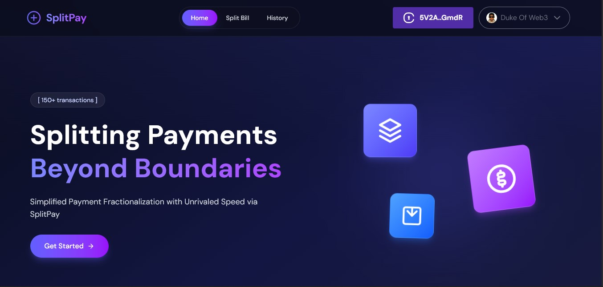
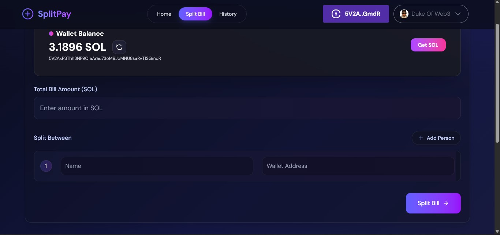

# SplitPay

> **Modern, Secure, and Decentralized Bill Splitting on Solana — Powered by Civic Auth**

---

## Overview

**SplitPay** is a next-generation web app that lets you split bills and send payments to friends instantly on the Solana blockchain. With a beautiful glassmorphism UI, real-time wallet integration, and robust security powered by [Civic Auth](https://www.civic.com/), SplitPay makes group payments seamless, transparent, and fun.

---

## Features

- **Split bills** with anyone by entering names and Solana wallet addresses
- **Instant payments** in SOL, directly on Solana devnet
- **Wallet connection** and balance display
- **Modern, glassy UI** with full mobile responsiveness
- **Transaction history** (coming soon)
- **Secure authentication** and user management — **Powered by Civic Auth**
- **Animated, beautiful user experience**

---

## Screenshots




> Note: Add your actual screenshots to a `screenshots` folder in the root directory. Recommended image formats: PNG or WebP.

---

## 🛠️ Getting Started

### 1. **Clone the repository**

```bash
git clone https://github.com/yourusername/splitpay.git
cd splitpay
```

### 2. **Install dependencies**

```bash
pnpm install
# or
yarn install
# or
npm install
```

### 3. **Set up environment variables**

Create a `.env` file in the root directory and add your Civic client ID:

```env
VITE_CIVIC_CLIENT_ID=your-civic-client-id-here
```

> _Get your Civic client ID from the [Civic dashboard](https://www.civic.com/)_

### 4. **Run the app**

```bash
pnpm dev
# or
yarn dev
# or
npm run dev
```

The app will be available at [http://localhost:5173](http://localhost:5173)

---

## Environment Variables

- `VITE_CIVIC_CLIENT_ID` — Your Civic Auth client ID (**required**)

---

## Usage

- **Split a bill:** Enter the total amount and add people with their Solana wallet addresses.
- **Send payments:** Click "Pay Now" to send SOL to each recipient securely.
- **Wallet:** Connect your Solana wallet and view your balance instantly.
- **Authentication:** All user authentication and security is **powered by Civic Auth**.

---

##  Tech Stack

- **React 19** + **Vite**
- **Tailwind CSS** for styling
- **Framer Motion** for animations
- **Solana Web3.js** for blockchain interactions
- **@civic/auth-web3** for authentication (**Powered by Civic Auth**)

---

## Security

- All authentication and user management is handled by [Civic Auth](https://www.civic.com/), ensuring secure, decentralized access.
- Sensitive keys (like the Civic client ID) are stored in environment variables and never hardcoded.

---

## Credits

- **Powered by Civic Auth** — [Civic](https://www.civic.com/)
- Built with ❤️ by Duke

---

## Powered by Civic Auth

> _SplitPay is proudly powered by Civic Auth for secure, decentralized authentication and user management._
